# 書籍管理システム 全体設計書 (TrainoBook System Specification)

本ドキュメントは、Spring Boot演習を通じて構築する「書籍管理システム（TrainoBook）」の全体像と、各章ごとの進化過程を視覚的にまとめたものです。受講者の皆さんが、各ステップが最終的にどのような形になるのかをイメージするためのガイドとして活用してください。

---

## 1. システム概要
本システムは、書籍情報の登録・一覧表示・詳細閲覧・更新・削除（CRUD）を行う基本的な管理システムです。章を追うごとに、認証（ログイン）、バリデーション、共通レイアウト、DB結合、そしてBootstrapによるモダンなUIへと進化していきます。

---

## 2. 各章の進化と画面遷移

### 第2章：Webアプリケーションの基礎 (HTML & Controller)
**マイルストーン**: 「生のHTML」での画面遷移とデータ通信の理解。
- **特徴**: スタイルが一切当たっていない、ブラウザ標準の表示状態。
- **機能**: ログイン（モック）、書籍一覧（モック）、書籍登録（モック）。

| 画面名 | スクリーンショット | 説明 |
| :--- | :--- | :--- |
| **書籍一覧** |  | 枠組みのみのテーブル表示です。 |
| **書籍登録** | 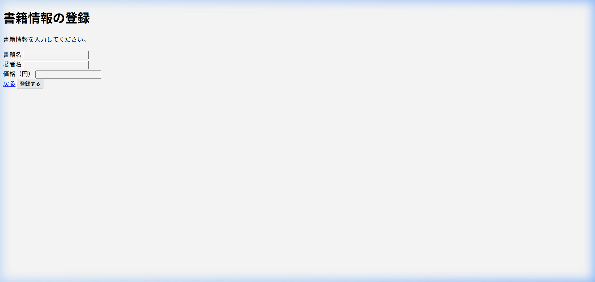 | 標準的なフォーム部品のみが並んでいます。 |

---

### 第4章：認証とバリデーション (Authentication & Validation)
**マイルストーン**: ユーザー認証と入力値チェックによる堅牢性の向上。
- **特徴**: DBによるログイン機能と、エラー時の赤い警告メッセージ。
- **機能**: ユーザーID/パスワードによる制限、入力漏れの防止。

| 画面名 | スクリーンショット | 説明 |
| :--- | :--- | :--- |
| **ログイン画面** | 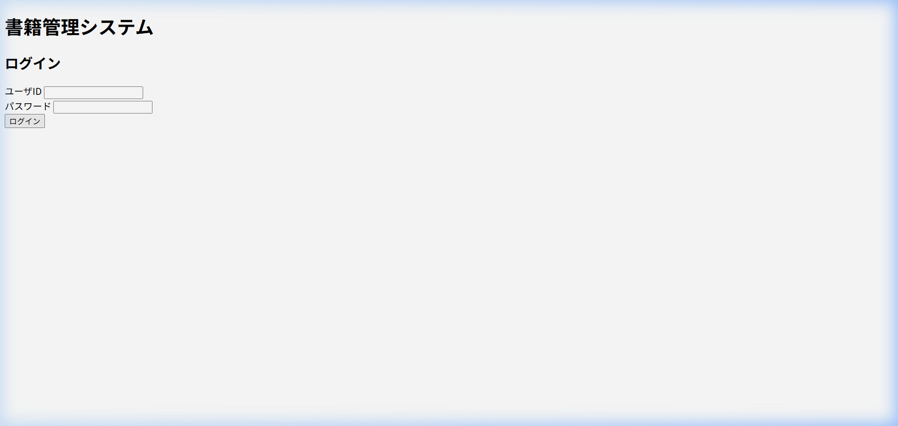 | 第2章の状態に、エラー表示領域が追加されています。 |
| **認証エラー** | 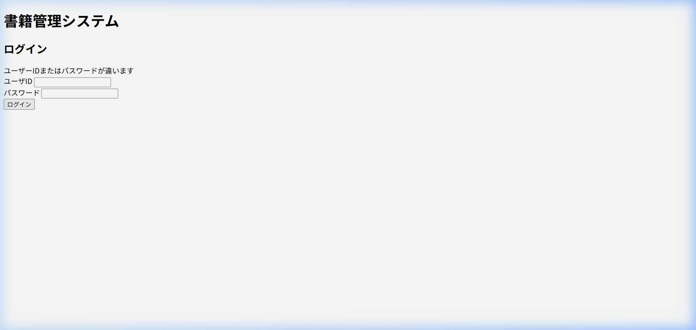 | 認証失敗時に「ユーザーIDまたはパスワードが違います」と表示されます。 |
| **登録エラー** | 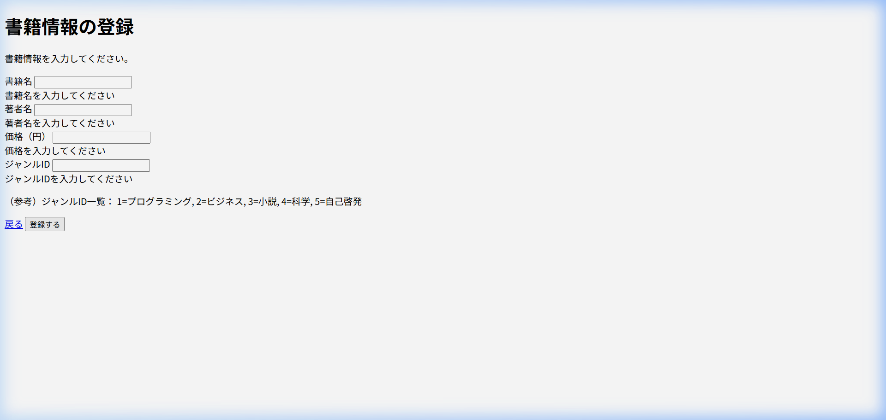 | バリデーションエラーにより、未入力項目に警告が表示されます。 |

---

### 第5章：共通レイアウト (Thymeleaf Layout Dialect)
**マイルストーン**: ヘッダー・フッターの共通化（DRY原則）。
- **特徴**: 独自CSS（style.css）の適用と、全画面共通のナビゲーション。
- **機能**: テンプレート継承、ログイン情報の常時表示。

| 画面名 | スクリーンショット | 説明 |
| :--- | :--- | :--- |
| **共通レイアウト** | 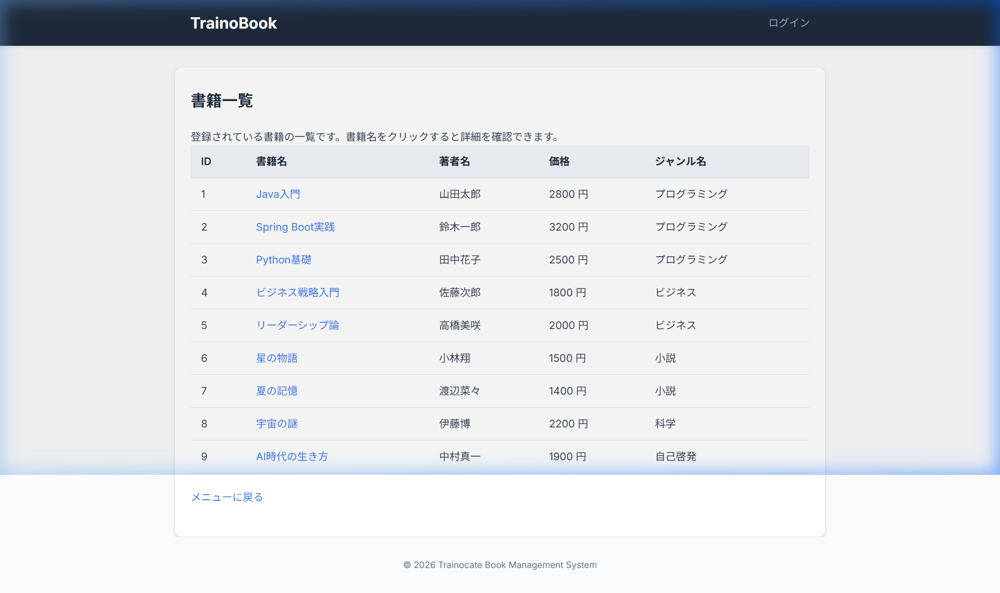 | 画面上部にダークトーンのヘッダーが導入されました。 |
| **フッター** | 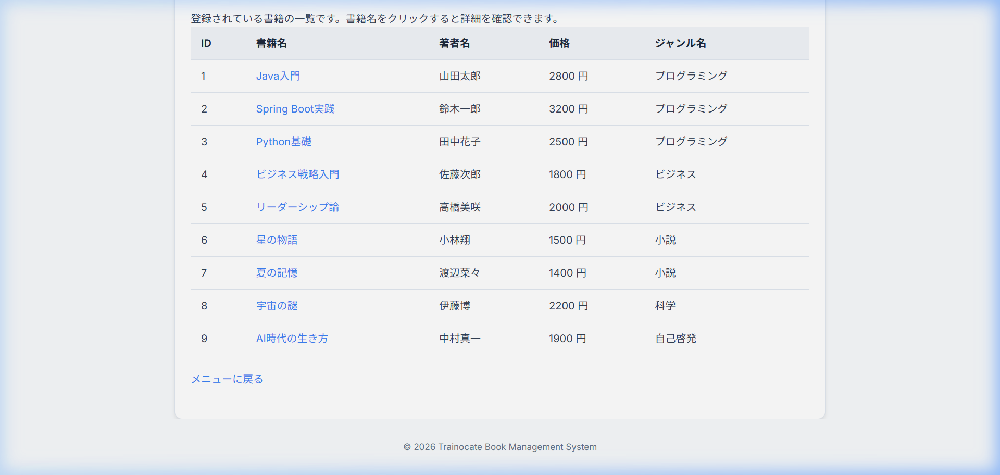 | 画面下部に著作権表記が追加されました。 |

---

### 第7章：完成形 - デザインの洗練 (Bootstrap)
**マイルストーン**: プロフェッショナルな外観とレスポンシブ対応。
- **特徴**: Bootstrap 5の導入。カード、モダンなボタン、洗練されたテーブル。
- **機能**: 全面的なUIアップグレード。

| 画面名 | スクリーンショット | 説明 |
| :--- | :--- | :--- |
| **ログイン(最終)** | 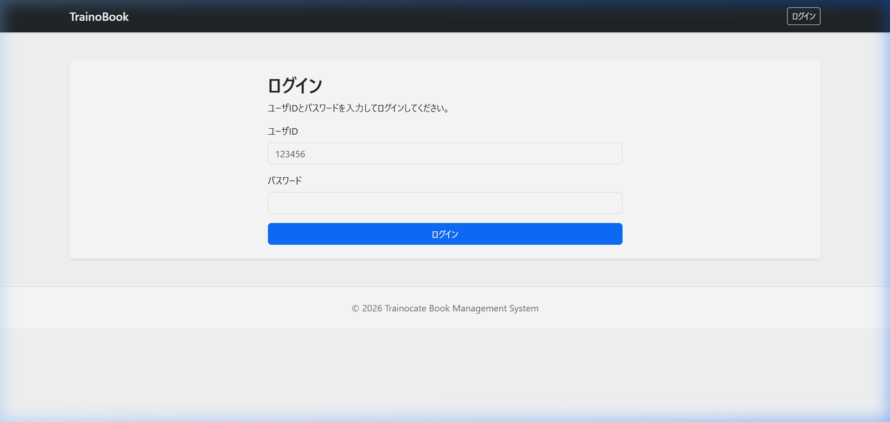 | 中央に配置されたカード形式のログインフォーム。 |
| **メニュー(最終)** | 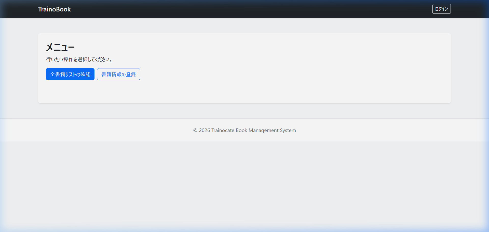 | コンテンツが整理され、操作しやすいボタン配置に。 |
| **書籍一覧(最終)** | 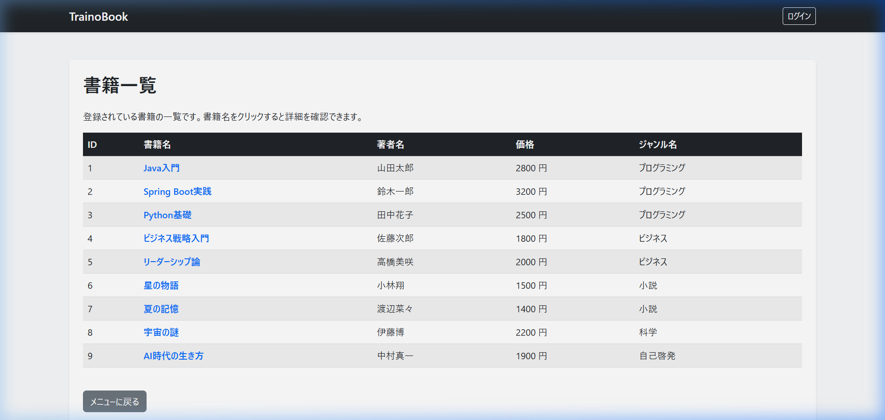 | 縞模様（Stripe）のついた見やすいテーブル。 |
| **検索結果(完)** | 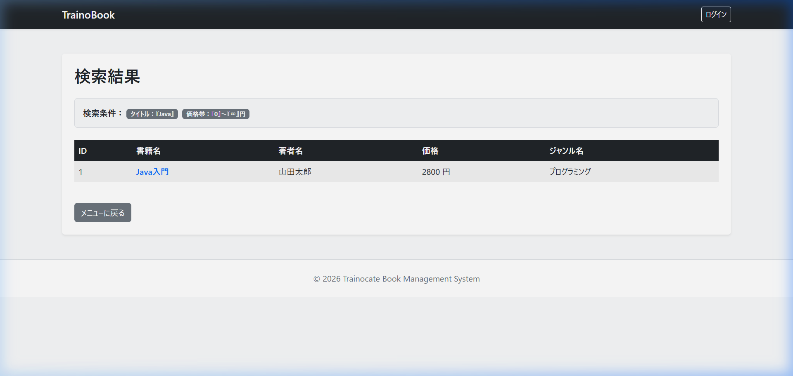 | 検索条件がバッジ形式で表示され、視認性が向上。 |

---

## 3. 最終的なデータベース構成 (ER図相当)

システムが完成した際のテーブル関係図です。

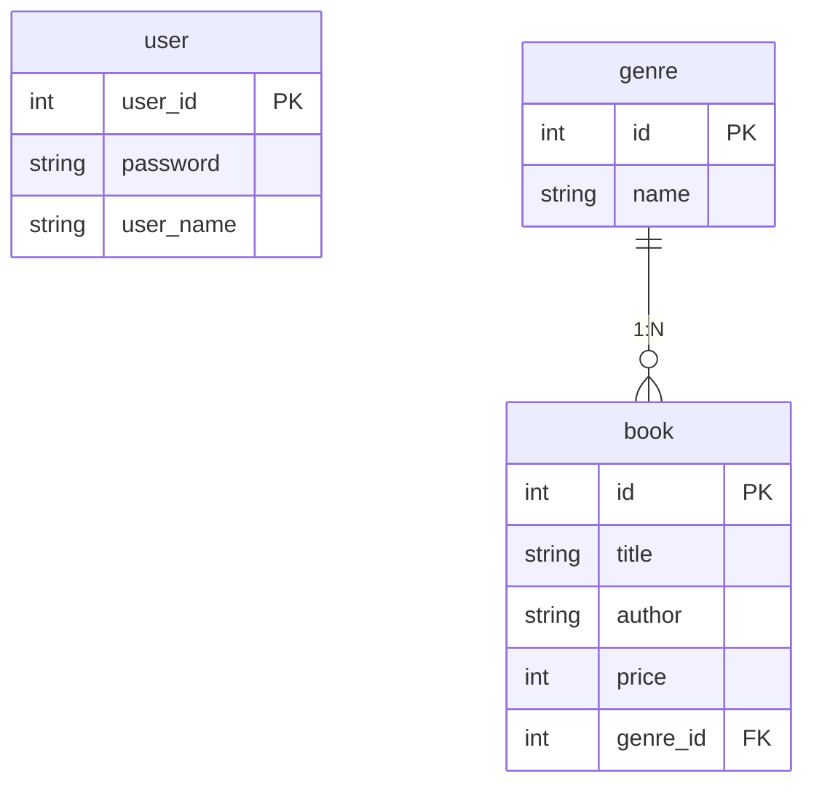

---

## 4. 学習のロードマップ
1. **第2章**: Webアプリの「骨組み」を作る（HTML, Controller）
2. **第3章**: 「データ」を保存・取得する（JPA, CRUD）
3. **第4章**: 「安全」なアプリにする（Validation, Session）
4. **第5章**: 「構造」を整理する（Layout Dialect）
5. **第6章**: 「高度」な連携を行う（Table Join, JPQL）
6. **第7章**: 「見た目」を完成させる（Bootstrap）

この全体設計書を目標に、一歩ずつ実装を楽しみましょう！
