# 書籍管理システム 全体設計書（進化のプロセス）

本ドキュメントは、演習を通してシステムがどのように進化していくかを可視化したものです。各章のマイルストーンごとに、画面遷移とデザインの変化を確認できます。

---

## 第2章：Spring Web アプリケーション（画面遷移とデータ通信）
**テーマ：モックデータによる画面遷移の確立**

最初のステップでは、データベースを使用せず、コントローラー内で作成した固定データ（モック）を使用して画面表示と遷移を確認します。

### 画面遷移図
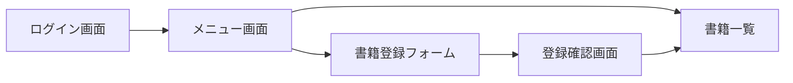

### 主要画面（拡大表示）
| ログイン画面 | 書籍登録フォーム |
| :---: | :---: |
| 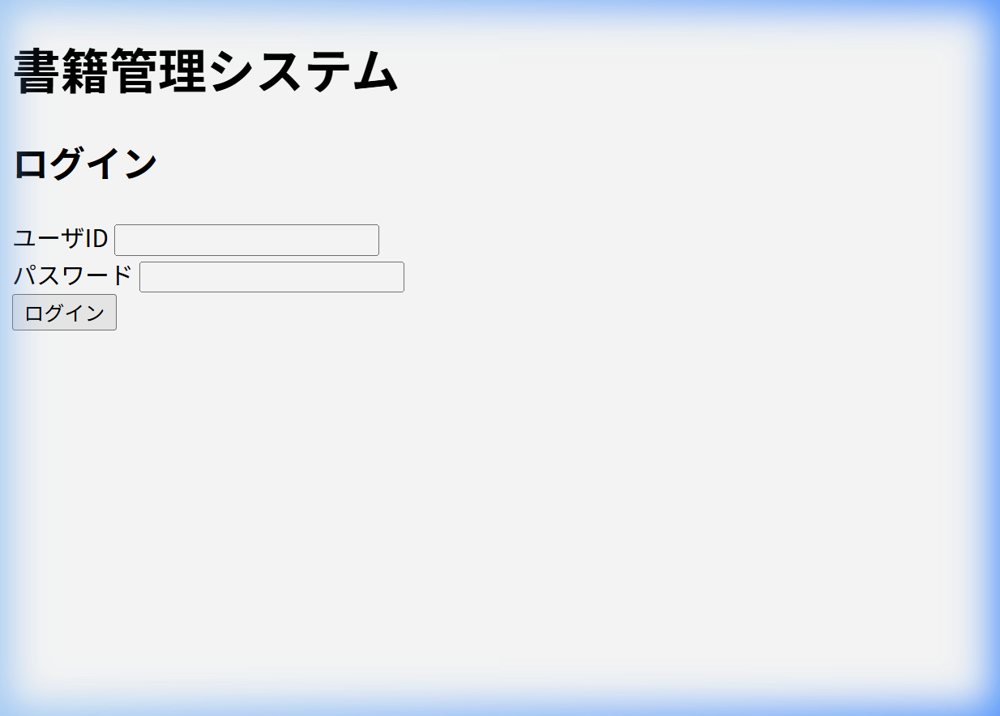 | 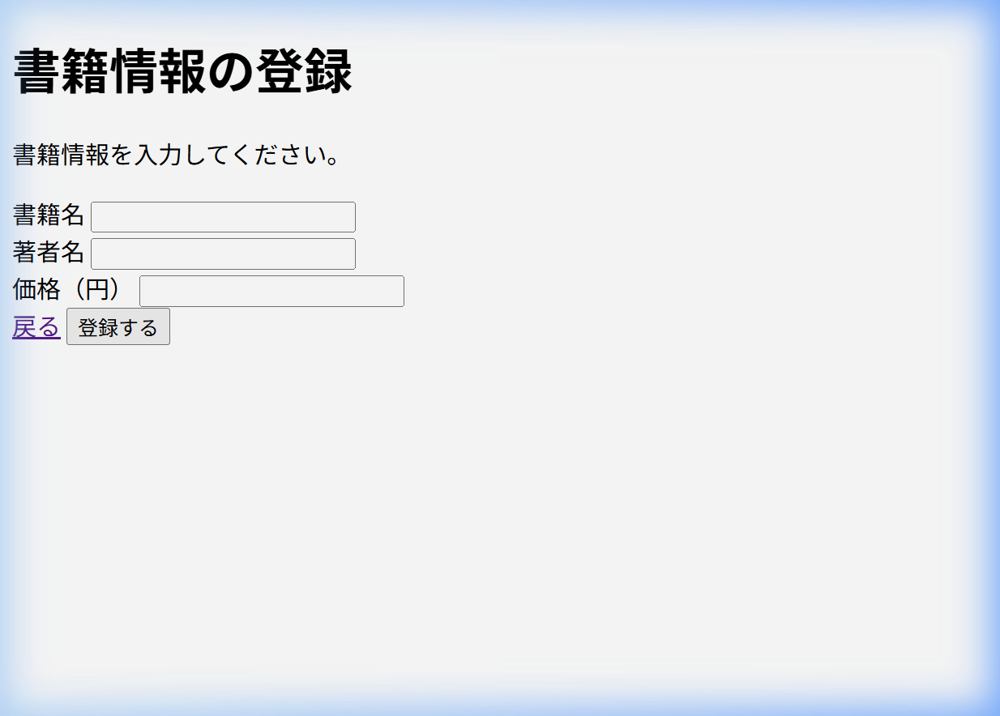 |

---

## 第3章：Spring Data JPA (DB連携) 
**テーマ：データの永続化（DBとの接続）**

第2章のモックデータを卒業し、MySQLデータベースと連携します。登録したデータが実際にDBに保存され、一覧画面で表示される「アプリケーションの骨格」が完成する重要な段階です。

### 画面遷移図
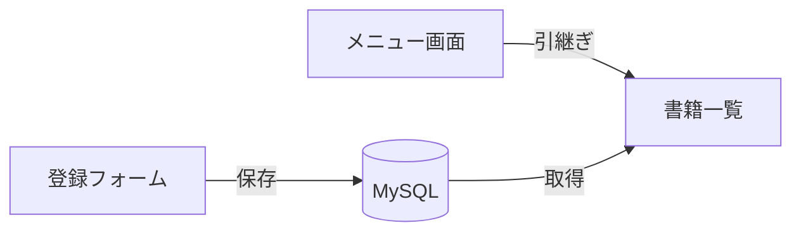

### 主要画面
| 書籍一覧（DBデータ表示） |
| :---: |
| 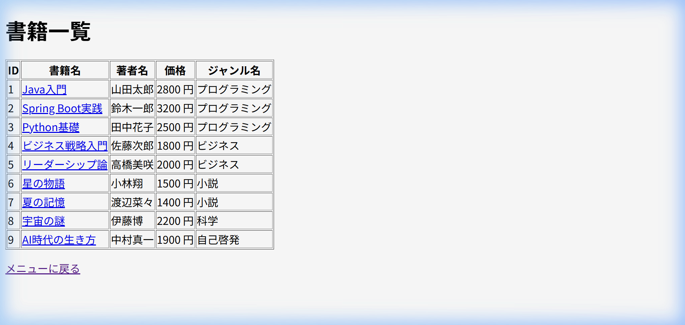 |

---

## 第4章：バリデーションと認証
**テーマ：入力チェックとセキュリティの基本**

不正なデータ入力を防ぐバリデーション機能と、セッションを利用した簡易的なログイン認証機能を実装します。

### 画面遷移図
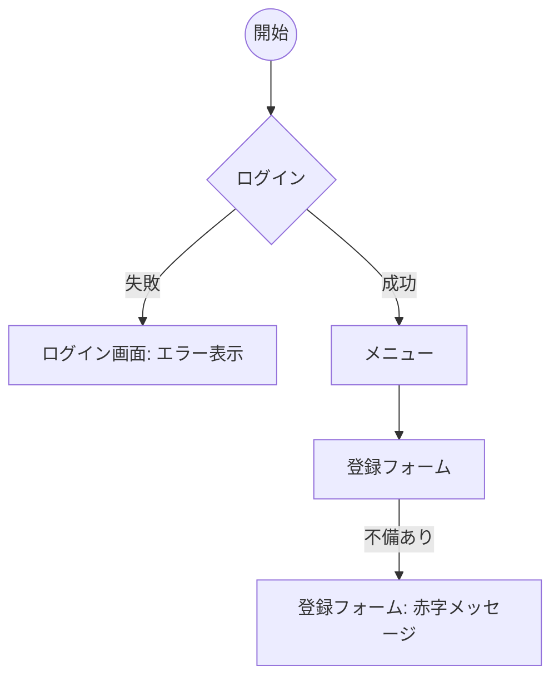

### 主要画面
| バリデーションエラー（赤字表示） |
| :---: |
| 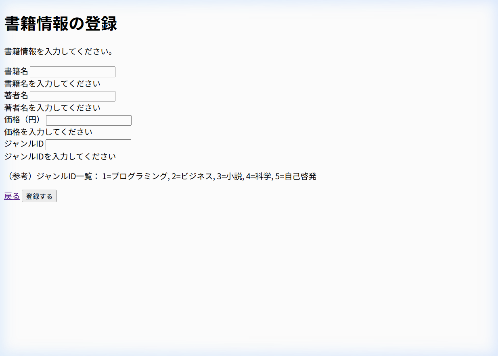 |

---

## 第5章：共通レイアウトの適用 (Thymeleaf Layout Dialect)
**テーマ：保守性の向上とデザインの統一**

ヘッダーやフッターを共通パーツ化し、すべての画面で統一された「Webアプリらしい」外観を実現します。

### 画面遷移図
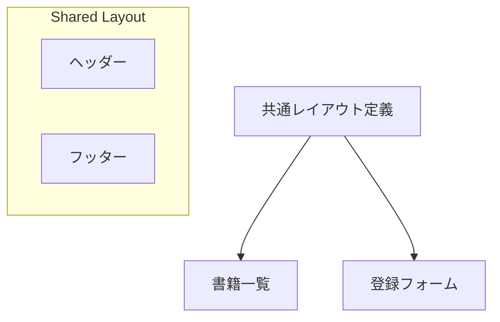

### 主要画面
| 共通レイアウト適用後の書籍一覧 |
| :---: |
|  |

---

## 第6章：リレーション（1対多）と検索機能
**テーマ：テーブル結合と動的クエリ**

「ジャンル」テーブルとの結合（Join）により、書籍にジャンル名を付与します。また、JPQLを用いた検索機能を実装します。

### 画面遷移図
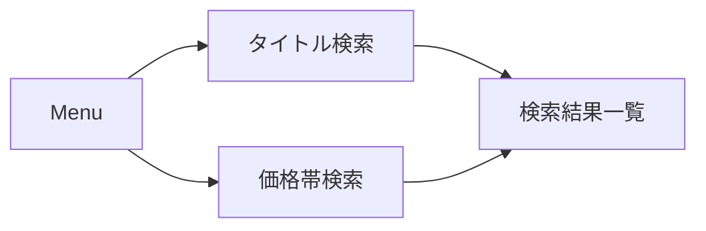

### 主要画面
| ジャンル選択（結合表示） | 検索結果（シンプル表示） |
| :---: | :---: |
|  | 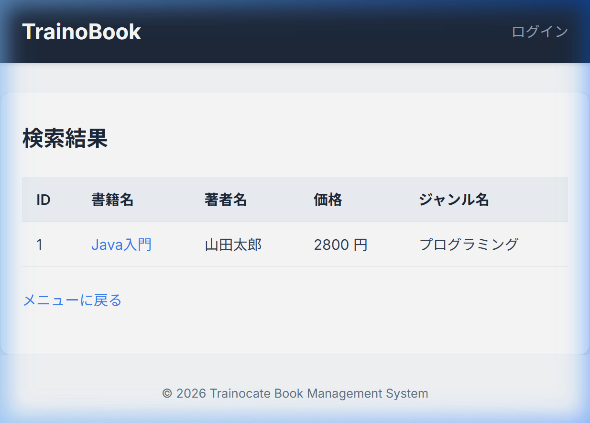 |

---

## 第7章：Bootstrapによるスタイリング（完成形）
**テーマ：モダンなUIデザインの体験**

CSSを自前で書くのではなく、世界的に普及しているフレームワーク「Bootstrap 5」を導入し、プレミアムな外観へと一新します。

### 画面遷移図
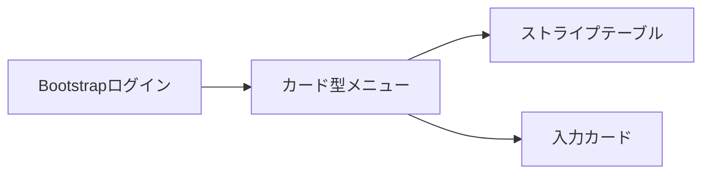

### 主要画面（最終形態）
| メニュー（カードデザイン） | 登録フォーム（Bootstrap適用） |
| :---: | :---: |
|  | 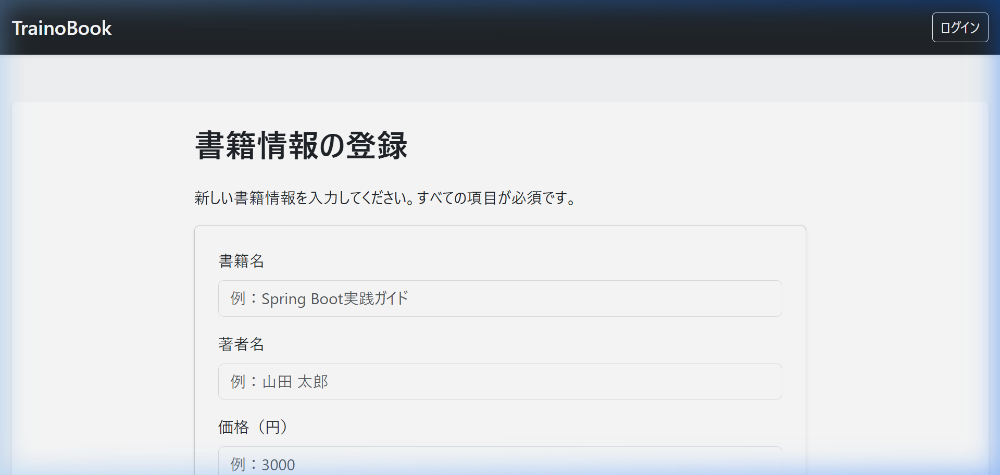 |

---

## データベース構造 (ER図)
システム全体で管理するデータの構造です。

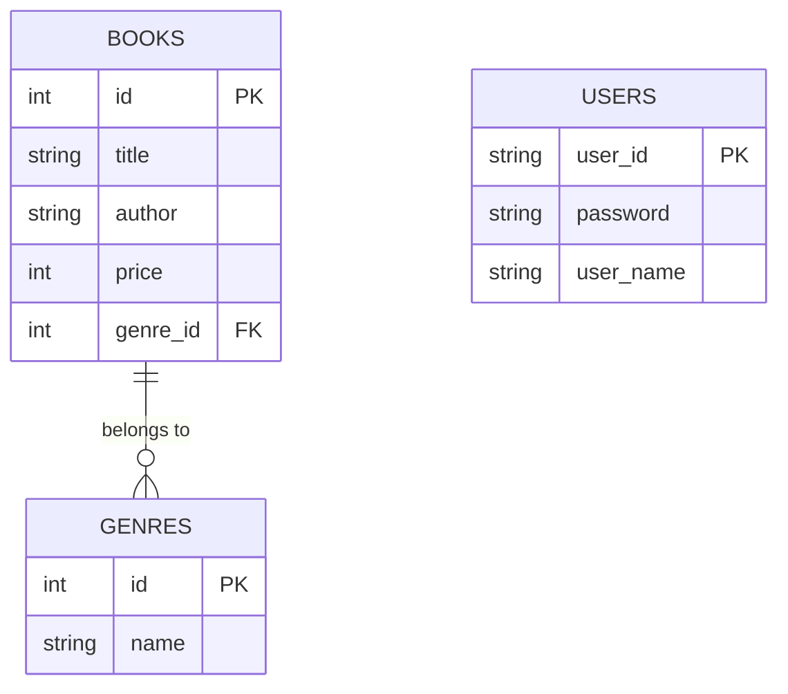
