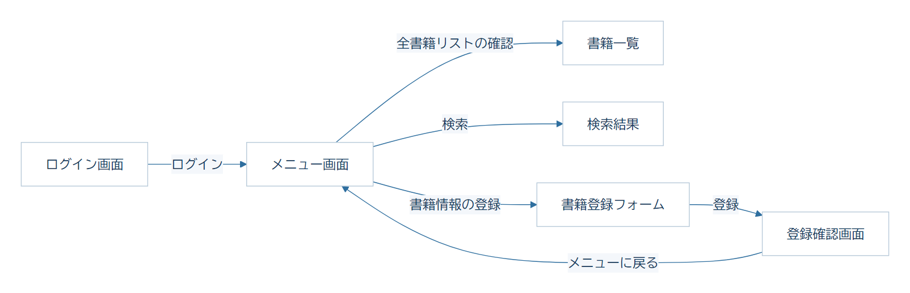
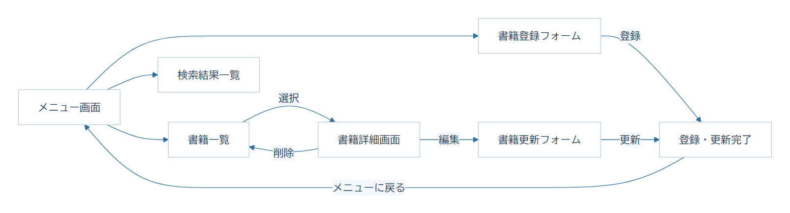
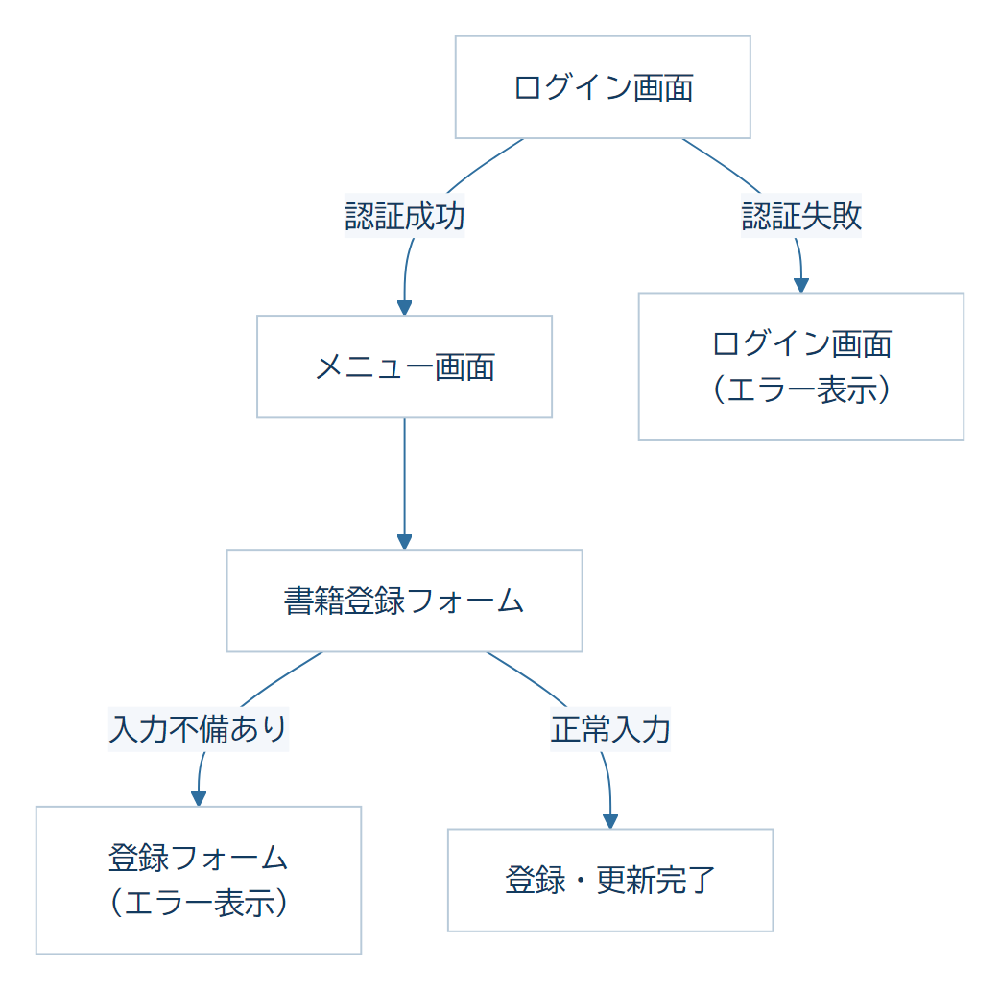
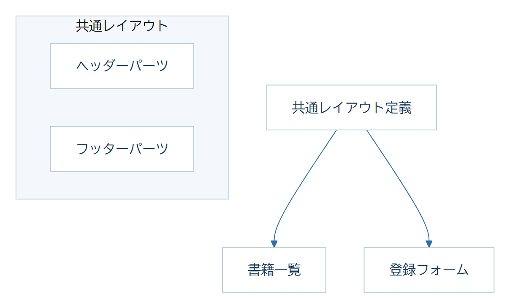
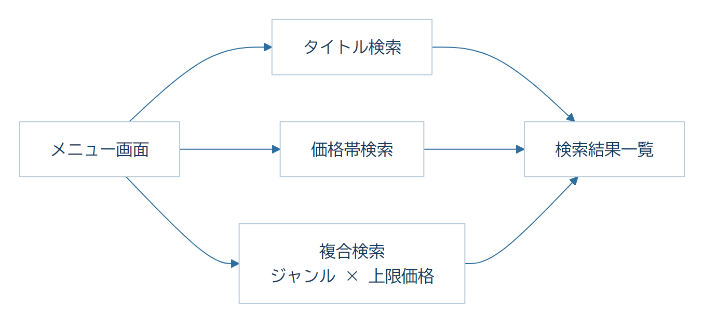
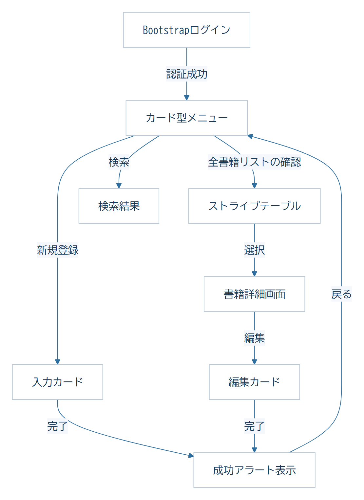
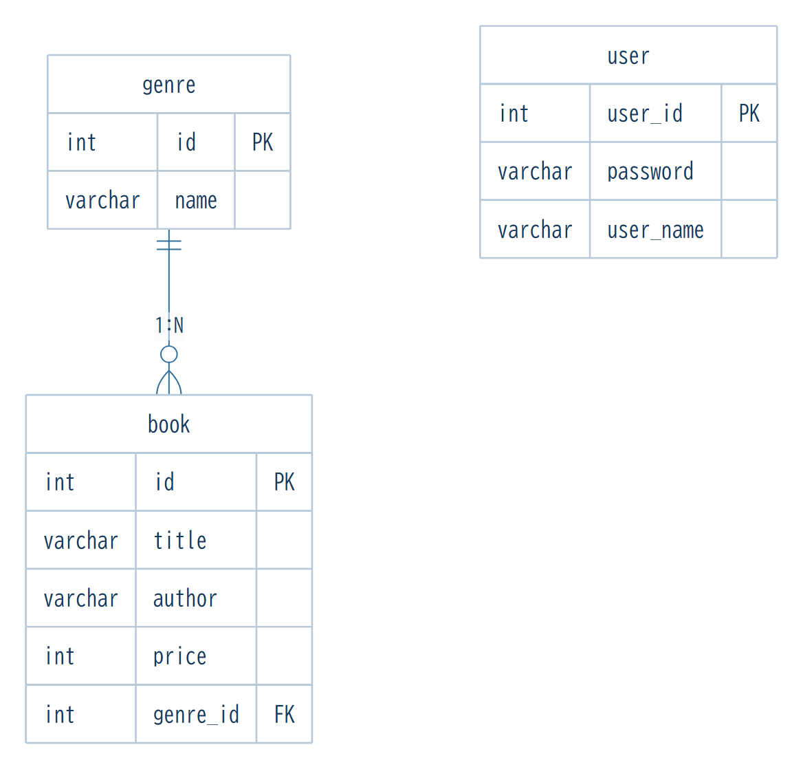

  
     
  <h1 style="border: none; font-size: 2.5em; color: #1a365d;">書籍管理システム 補足資料</h1>
  <h2 style="color: #666; font-weight: 300;">画面遷移・イメージ図・ER図</h2>
        

## 目次

- 第2章：Spring Web アプリケーション（画面遷移とデータ通信） ...... p.4
  - 画面遷移図 ...... p.4
  - 主要画面 ...... p.5
- 第3章：Spring Data JPA (DB連携) ...... p.7
  - 画面遷移図 ...... p.7
  - 主要画面 ...... p.8
- 第4章：バリデーションと認証 ...... p.9
  - 画面遷移図 ...... p.9
  - 主要画面 ...... p.10
- 第5章：共通レイアウトの適用 (Thymeleaf Layout Dialect) ...... p.11
  - 画面遷移図 ...... p.11
  - 主要画面 ...... p.12
- 第6章：高度なデータ連携とユーザー体験の向上 ...... p.13
  - 画面遷移図 ...... p.13
  - 主要画面 ...... p.14
- 第7章：Bootstrapによるスタイリング（完成形態） ...... p.15
  - 画面遷移図 ...... p.15
  - 主要画面 ...... p.16
- データベース構造 (ER図) ...... p.18
- 初期データ一覧 ...... p.18

  <h1 style="border: none; font-size: 1.8em; color: #1a365d; margin-bottom: 5px;">書籍管理システム 補足資料</h1>
  （画面遷移・イメージ図・ER図）

本ドキュメントは、個人演習の補足資料です。演習を進めるにあたり、各章ごとの最終的な完成形（画面遷移や各画面のイメージ図）とデータベースの構造（ER図）を確認するためのリファレンスとして活用してください。

---

## 第2章：Spring Web アプリケーション（画面遷移とデータ通信）

  <strong>【テーマ】モックデータによる画面遷移の確立</strong>  
  この段階ではデータベースを使用せず、Controller内で作成した固定データ（モック）を使用して画面表示と遷移を確認します。

### 画面遷移図

<figure class="diagram-card">
  
</figure>

### 主要画面

  <figure class="screen-card">
    <figcaption>ログイン画面（モック：DB認証なしでの遷移テスト）</figcaption>
    
  </figure>
  <figure class="screen-card">
    <figcaption>メニュー画面（モック：主要機能への導線確認）</figcaption>
    
  </figure>
  <figure class="screen-card">
    <figcaption>登録フォーム（入力値の受け渡しテスト用）</figcaption>
    
  </figure>
  <figure class="screen-card">
    <figcaption>登録内容の確認画面（入力値と遷移の妥当性確認）</figcaption>
    
  </figure>
  <figure class="screen-card">
    <figcaption>書籍一覧（モックデータによる一覧表示の確認）</figcaption>
    
  </figure>
  <figure class="screen-card">
    <figcaption>検索結果画面（固定データによる表示レイアウトの確認）</figcaption>
    
  </figure>

---

## 第3章：Spring Data JPA (DB連携) 

  <strong>【テーマ】データの永続化（DBとの接続）</strong>  
  モックデータを卒業し、MySQLデータベースと連携します。第2章で作成した検索機能も、実際にDBからデータを取得するように実装します。

### 画面遷移図

<figure class="diagram-card">
  
</figure>

### 主要画面

  <figure class="screen-card">
    <figcaption>メニュー画面（DBからデータを取得する検索機能の実装）</figcaption>
    
  </figure>
  <figure class="screen-card">
    <figcaption>書籍一覧（MySQLから取得したデータの表示確認）</figcaption>
    
  </figure>
  <figure class="screen-card">
    <figcaption>個別情報の詳細表示（DBからの特定ID取得の検証）</figcaption>
    
  </figure>
  <figure class="screen-card">
    <figcaption>登録・更新完了画面（DB書き換えの成功報告）</figcaption>
    
  </figure>
  <figure class="screen-card">
    <figcaption>編集フォーム（DB情報の初期表示・変更確認）</figcaption>
    
  </figure>
  <figure class="screen-card">
    <figcaption>タイトル検索結果（DBの部分一致検索の確認）</figcaption>
    
  </figure>

---

## 第4章：バリデーションと認証

  <strong>【テーマ】入力チェックとセキュリティの基本</strong>  
  不正な入力を防ぐバリデーション機能と、セッションを利用した認証機能を実装します。

### 画面遷移図

<figure class="diagram-card">
  
</figure>

### 主要画面

  <figure class="screen-card">
    <figcaption>ログイン認証失敗（意図したエラーメッセージの表出）</figcaption>
    
  </figure>
  <figure class="screen-card">
    <figcaption>入力チェックエラー（アノテーションによる不備検知）</figcaption>
    
  </figure>
  <figure class="screen-card">
    <figcaption>メニュー画面（セッションから取得したユーザー情報の表示）</figcaption>
    
  </figure>

---

## 第5章：共通レイアウトの適用 (Thymeleaf Layout Dialect)

  <strong>【テーマ】保守性の向上とデザインの統一</strong>  
  ヘッダーやフッターを共通パーツ化し、すべての画面で統一された外観を実現します。

### 画面遷移図

<figure class="diagram-card">
  
</figure>

### 主要画面

  <figure class="screen-card">
    <figcaption>ログイン画面（共通レイアウト適用：未ログイン状態）</figcaption>
    
  </figure>
  <figure class="screen-card">
    <figcaption>書籍一覧（共通レイアウト適用：ログイン中ヘッダー表示）</figcaption>
    
  </figure>
  <figure class="screen-card">
    <figcaption>登録・更新画面（共通レイアウトによる画面デザインの統一）</figcaption>
    
  </figure>

---

## 第6章：高度なデータ連携とユーザー体験の向上

  <strong>【テーマ】動的な項目取得（ジャンル連携）と0件制御・JPQL検索</strong>  
  検索結果が0件の場合のメッセージ表示（0件制御）や、DBから取得したジャンル一覧をセレクトボックスとしてフォームに動的に反映させる機能を実装します。また、Repository層でJPQLを活用し、ジャンル名と価格による高度な複合検索を可能にします。

### 画面遷移図

<figure class="diagram-card">
  
</figure>

### 主要画面

  <figure class="screen-card">
    <figcaption>登録フォーム（DBから動的に抽出したジャンル選択）</figcaption>
    
  </figure>
  <figure class="screen-card">
    <figcaption>検索結果（該当データなし：UX向上のための0件案内）</figcaption>
    
  </figure>
  <figure class="screen-card">
    <figcaption>複合検索フォーム（ジャンル名：プログラミング、上限価格：5000を指定）</figcaption>
    
  </figure>
  <figure class="screen-card">
    <figcaption>JPQLによる複合検索結果（ジャンル：プログラミング、上限価格：5000）</figcaption>
    
  </figure>

---

---

## 第7章：Bootstrapによるスタイリング（完成形態）

  <strong>【テーマ】モダンなUIデザインの導入とUXの完成</strong>  
  Bootstrap 5 を導入し、画面デザインを整えます。Navbar や Container などの共通レイアウトを適用することで、レスポンシブで一貫性のあるUIを構築する方法を学びます。

### 画面遷移図

<figure class="diagram-card">
  
</figure>

### 主要画面

  <figure class="screen-card">
    <figcaption>ログイン画面（グリッドシステムによる中央配置とalert表示の統合）</figcaption>
    
  </figure>
  <figure class="screen-card">
    <figcaption>メニュー画面（cardクラスとg-4による機能のカード型レイアウト）</figcaption>
    
  </figure>
  <figure class="screen-card">
    <figcaption>書籍一覧画面（table-striped、table-hover、table-darkの適用による視認性向上）</figcaption>
    
  </figure>
  <figure class="screen-card">
    <figcaption>書籍詳細画面（container内での整理されたデータ表示とアクションボタン）</figcaption>
    
  </figure>
  <figure class="screen-card">
    <figcaption>書籍登録フォーム（form-controlとform-selectによるモダンな入力体験）</figcaption>
    
  </figure>
  <figure class="screen-card">
    <figcaption>書籍更新フォーム（既存データの編集とレイアウトの完全な統一）</figcaption>
    
  </figure>
  <figure class="screen-card">
    <figcaption>登録・更新完了画面（操作の成功を知らせる明示的な通知レイアウト）</figcaption>
    
  </figure>
  <figure class="screen-card">
    <figcaption>検索結果画面（該当なし：alert-warningクラスによる親切な0件案内）</figcaption>
    
  </figure>

---

## データベース構造 (ER図)
システム全体で管理するデータの構造です。

<figure class="diagram-card">
  
</figure>

### 初期データ一覧
データベースセットアップ時（`dbsetup`実行時）に登録される初期データ一覧です。テストや動作確認の際に活用してください。

**■ `genre` テーブル（ジャンル）**

| id | name |
|:---:|---|
| 1 | プログラミング |
| 2 | ビジネス |
| 3 | 小説 |
| 4 | 科学 |
| 5 | 自己啓発 |

**■ `book` テーブル（書籍）**

| id | title | author | price | genre_id |
|:---:|---|---|---:|:---:|
| 1 | Java入門 | 山田太郎 | 2800 | 1 |
| 2 | Spring Boot実践 | 鈴木一郎 | 3200 | 1 |
| 3 | Python基礎 | 田中花子 | 2500 | 1 |
| 4 | ビジネス戦略入門 | 佐藤次郎 | 1800 | 2 |
| 5 | リーダーシップ論 | 高橋美咲 | 2000 | 2 |
| 6 | 星の物語 | 小林翔 | 1500 | 3 |
| 7 | 夏の記憶 | 渡辺菜々 | 1400 | 3 |
| 8 | 宇宙の謎 | 伊藤博 | 2200 | 4 |
| 9 | AI時代の生き方 | 中村真一 | 1900 | 5 |

**■ `user` テーブル（ユーザ）**

| user_id | password | user_name |
|:---:|---|---|
| 100001 | pass1234 | 山田太郎 |
| 100002 | pass2345 | 鈴木花子 |
| 100003 | pass3456 | 田中一郎 |
